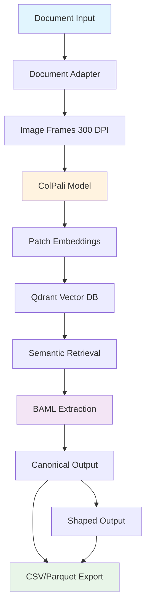
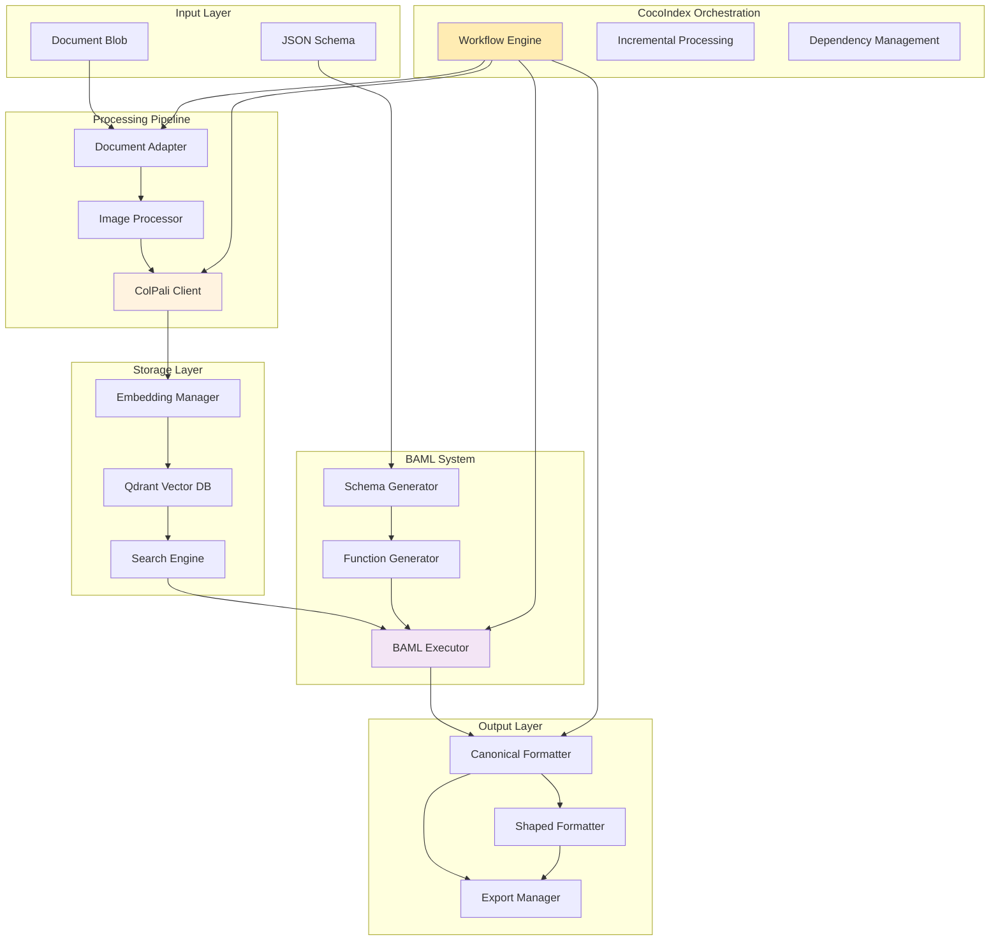

# ColPali-BAML Architecture Playbook

> **Technical Foundation Document**: Comprehensive architectural guide for the vision-based document processing engine using ColPali, BAML, Qdrant, and CocoIndex orchestration.

## Table of Contents
1. [System Overview](#system-overview)
2. [Technology Stack Deep Dive](#technology-stack-deep-dive)
3. [Development Guidelines](#development-guidelines)
4. [Deployment Architecture](#deployment-architecture)
5. [Performance Characteristics](#performance-characteristics)
6. [Troubleshooting Guide](#troubleshooting-guide)

---

## System Overview

### Architecture Principles

**Vision-Native Processing**
- All documents converted to canonical image frames (300 DPI)
- No OCR dependency - pure visual understanding
- Format-agnostic approach supporting PDF, Excel, PowerPoint, Word, HTML

**Schema-Governed Extraction**
- JSON schemas automatically converted to BAML classes
- Type-safe structured output with Pydantic validation
- Dynamic function generation for diverse document types

**Dual Architecture (Truth + Business)**
- **Canonical Layer**: Faithful extraction without modification
- **Shaped Layer**: Business transformations with 1NF enforcement
- Complete lineage tracking from source to output

**Container-First Deployment**
- Docker containers for all environments
- AWS Lambda optimization for serverless deployment
- Multi-stage builds for development, production, and notebooks

### High-Level Data Flow



### Component Interaction Map



---

## Technology Stack Deep Dive

### 🎯 ColPali Model Specifications

**Model Architecture**
- **Model**: ColQwen2-v0.1 (3B parameters)
- **Vision Processing**: Patch-level embeddings (32x32 regions)
- **Embedding Dimensions**: 128 per patch
- **Memory Requirements**: ~3GB base model + processing overhead

**Technical Integration**
```python
# ColPali Client Implementation Pattern
class ColPaliClient:
    def __init__(self, model_name: str = "vidore/colqwen2-v0.1"):
        self.model = ColQwen2.from_pretrained(model_name)
        self.processor = ColQwen2Processor.from_pretrained(model_name)
        self._optimize_for_lambda()

    def _optimize_for_lambda(self):
        # Model quantization for memory efficiency
        self.model = torch.quantization.quantize_dynamic(
            self.model, {torch.nn.Linear}, dtype=torch.qint8
        )

    async def embed_frames(self, images: List[Image.Image]) -> List[torch.Tensor]:
        # Batch processing with memory management
        batch_size = self._calculate_optimal_batch_size()
        embeddings = []

        for i in range(0, len(images), batch_size):
            batch = images[i:i+batch_size]
            with torch.no_grad():
                batch_embeddings = self._process_batch(batch)
                embeddings.extend(batch_embeddings)

        return embeddings
```

**Performance Characteristics**
- **Cold Start**: <10 seconds with optimization
- **Processing Speed**: ~2-3 seconds per page
- **Memory Usage**: <8GB for Lambda compliance
- **Batch Efficiency**: 4-8 pages optimal batch size

### 🔍 Qdrant Vector Database Configuration

**Collection Schema Design**
```json
{
  "collection_name": "colpali_embeddings",
  "vector_config": {
    "size": 128,
    "distance": "Cosine"
  },
  "payload_schema": {
    "document_id": "keyword",
    "page_number": "integer",
    "patch_coordinates": "geo",
    "confidence_score": "float",
    "extraction_timestamp": "datetime",
    "source_metadata": "text"
  }
}
```

**Multi-Vector Storage Strategy**
- **Hierarchical Storage**: Document → Pages → Patches
- **Spatial Indexing**: Coordinate-based retrieval
- **Metadata Filtering**: Efficient queries by document properties
- **Batch Operations**: Optimized for large document ingestion

**Query Patterns**
```python
# Semantic retrieval with spatial filtering
async def query_relevant_patches(
    self,
    query_embedding: torch.Tensor,
    document_id: str = None,
    spatial_region: BoundingBox = None,
    confidence_threshold: float = 0.7
) -> List[ScoredPatch]:

    filter_conditions = []
    if document_id:
        filter_conditions.append({"key": "document_id", "match": {"value": document_id}})
    if spatial_region:
        filter_conditions.append({
            "key": "patch_coordinates",
            "geo_bounding_box": spatial_region.to_dict()
        })

    results = await self.qdrant_client.search(
        collection_name="colpali_embeddings",
        query_vector=query_embedding.tolist(),
        query_filter={"must": filter_conditions},
        limit=50,
        score_threshold=confidence_threshold
    )

    return [ScoredPatch.from_qdrant_result(r) for r in results]
```

### 🏗️ CocoIndex Orchestration Patterns

**Flow Definition Structure**
```python
@cocoindex.flow
async def vision_extraction_pipeline(
    document_blob: bytes,
    schema_json: dict,
    extraction_config: ExtractionConfig = None
) -> ExtractionResult:

    # Stage 1: Document Processing
    image_frames = await document_adapter.convert_to_frames(
        content=document_blob,
        dpi=300,
        format="RGB"
    )

    # Stage 2: Vision Processing (with dependency on Stage 1)
    embeddings = await colpali_client.embed_frames(
        images=image_frames,
        batch_size="auto"
    )

    # Stage 3: Vector Storage (parallel with Stage 4)
    storage_task = asyncio.create_task(
        qdrant_manager.store_embeddings(embeddings, metadata)
    )

    # Stage 4: Schema Processing (parallel with Stage 3)
    baml_classes = schema_manager.generate_baml_classes(schema_json)

    # Stage 5: Extraction (depends on Stages 3 & 4)
    await storage_task  # Ensure storage complete
    relevant_patches = await search_engine.query_relevant_patches(schema_json)
    canonical_data = await baml_interface.extract_structured(
        patches=relevant_patches,
        schema_classes=baml_classes
    )

    # Stage 6: Output Generation
    shaped_data = shaped_formatter.transform_to_1nf(canonical_data)

    return ExtractionResult(
        canonical=canonical_data,
        shaped=shaped_data,
        lineage=lineage_tracker.get_full_lineage()
    )
```

**Caching and Incremental Processing**
- **Document Fingerprinting**: SHA-256 hash of content + schema
- **Multi-Level Caching**: Image frames, embeddings, extraction results
- **TTL Policies**: Configurable cache expiration
- **Dependency Tracking**: Invalidate downstream caches when inputs change

### 🎨 BAML Type System Integration

**Schema Conversion Engine**
```python
def json_to_baml_converter(json_schema: dict) -> BAMLDefinition:
    """Convert JSON Schema to BAML class and function definitions."""

    # Example transformation
    input_schema = {
        "type": "object",
        "properties": {
            "shipping_manifest": {
                "type": "object",
                "properties": {
                    "vessel_name": {"type": "string"},
                    "cargo_items": {
                        "type": "array",
                        "items": {
                            "type": "object",
                            "properties": {
                                "description": {"type": "string"},
                                "weight": {"type": "number"},
                                "destination": {"type": "string"}
                            }
                        }
                    },
                    "total_weight": {"type": "number"}
                },
                "required": ["vessel_name", "cargo_items"]
            }
        }
    }

    # Generated BAML output
    baml_output = """
    class CargoItem {
        description string?
        weight float?
        destination string?
    }

    class ShippingManifest {
        vessel_name string
        cargo_items CargoItem[]
        total_weight float?
    }

    function ExtractShippingManifest(document_images: image[]) -> ShippingManifest {
        client CustomSonnet4
        prompt #"
            {{ _.role("user") }}
            Extract shipping manifest information from these document images:
            {{ document_images }}

            Focus on:
            - Vessel name (exact match)
            - All cargo items with descriptions and weights
            - Total weight calculation
            - Preserve spatial relationships between table rows

            Return structured data matching the ShippingManifest schema.
            {{ ctx.output_format }}
        "#
    }
    """

    return BAMLDefinition(
        classes=extract_classes(baml_output),
        functions=extract_functions(baml_output),
        validation_rules=generate_validation_rules(json_schema)
    )
```

**Dynamic Function Generation**
- **Prompt Templates**: Vision-optimized prompts for document extraction
- **Client Selection**: Automatic selection based on schema complexity
- **Retry Strategies**: Integration with existing BAML retry policies
- **Quality Validation**: Post-extraction validation against original schema

---

## Development Guidelines

### 🐳 Docker Development Workflow

**Multi-Stage Container Strategy**
```dockerfile
# Base stage - shared dependencies
FROM python:3.13-slim as base
RUN apt-get update && apt-get install -y \
    poppler-utils \
    wkhtmltopdf \
    libreoffice-headless \
    && rm -rf /var/lib/apt/lists/*

# Development stage
FROM base as development
COPY requirements/dev.txt .
RUN pip install -r dev.txt
# ... development-specific setup

# Lambda stage - optimized for size and cold start
FROM base as lambda
COPY requirements/lambda.txt .
RUN pip install --no-cache-dir -r lambda.txt
# ... Lambda-specific optimizations

# Jupyter stage - interactive analysis
FROM base as jupyter
COPY requirements/jupyter.txt .
RUN pip install -r jupyter.txt
# ... Jupyter-specific setup
```

**Development Environment Setup**
```bash
# 1. Start the development environment
docker-compose up -d

# 2. Access the development container
docker-compose exec colpali-engine bash

# 3. Run tests with PDF samples
pytest tests/ --pdf-samples=/app/test_data

# 4. Interactive development with Jupyter
docker-compose exec jupyter jupyter lab --ip=0.0.0.0 --port=8888
```

### 🧪 Testing Procedures with PDF Samples

**Test Data Organization**
```
tests/
├── fixtures/
│   ├── pdf_samples/          # 15 test PDFs from /pdfs/
│   ├── expected_outputs/     # Golden master results
│   └── schemas/             # Test JSON schemas
├── integration/
│   ├── test_end_to_end.py   # Full pipeline tests
│   ├── test_pdf_processing.py
│   └── test_schema_generation.py
├── unit/
│   ├── test_adapters.py
│   ├── test_colpali_client.py
│   └── test_baml_interface.py
└── performance/
    ├── test_memory_usage.py
    └── test_processing_speed.py
```

**Integration Test Patterns**
```python
@pytest.mark.parametrize("pdf_file,expected_schema", [
    ("extreme_multi_column.pdf", "complex_table_schema.json"),
    ("Shipping-Stem-2025-09-30.pdf", "shipping_manifest_schema.json"),
    ("semantic_table.pdf", "generic_table_schema.json"),
])
async def test_end_to_end_extraction(pdf_file, expected_schema, test_fixtures):
    """Test complete pipeline from PDF to structured output."""

    # Load test data
    pdf_path = test_fixtures.pdf_samples / pdf_file
    schema_path = test_fixtures.schemas / expected_schema

    with open(pdf_path, 'rb') as f:
        document_blob = f.read()
    with open(schema_path, 'r') as f:
        schema_json = json.load(f)

    # Execute pipeline
    result = await vision_extraction_pipeline(document_blob, schema_json)

    # Validate results
    assert result.canonical is not None
    assert result.shaped is not None
    assert len(result.lineage.steps) >= 5  # All processing steps recorded

    # Schema conformance validation
    validate_against_schema(result.canonical, schema_json)
    validate_1nf_compliance(result.shaped)

    # Quality metrics
    assert result.quality_metrics.confidence_score > 0.8
    assert result.quality_metrics.completeness_ratio > 0.9
```

### 📋 Code Organization Principles

**Clean Architecture Implementation**
```
tatforge/
├── core/                    # Business logic and orchestration
│   ├── domain/             # Domain entities and value objects
│   ├── use_cases/          # Application business rules
│   └── interfaces/         # Abstract interfaces
├── adapters/               # External system adapters
│   ├── document/          # Document format adapters
│   ├── storage/           # Database and cache adapters
│   └── vision/            # ML model adapters
├── infrastructure/         # Framework and driver details
│   ├── config/            # Configuration management
│   ├── logging/           # Logging setup
│   └── monitoring/        # Metrics and health checks
└── delivery/              # Delivery mechanisms
    ├── api/               # REST API handlers
    ├── lambda/            # AWS Lambda handlers
    └── cli/               # Command-line interface
```

**Dependency Injection Pattern**
```python
# Container configuration
@container.provider
class ApplicationContainer:

    # Configuration
    config = providers.Configuration()

    # Infrastructure
    qdrant_client = providers.Singleton(
        QdrantClient,
        url=config.qdrant.url,
        port=config.qdrant.port
    )

    # Core services
    colpali_client = providers.Singleton(
        ColPaliClient,
        model_name=config.colpali.model_name
    )

    document_processor = providers.Factory(
        DocumentProcessor,
        colpali_client=colpali_client,
        vector_store=qdrant_client
    )

    # Use cases
    extraction_use_case = providers.Factory(
        ExtractionUseCase,
        document_processor=document_processor
    )
```

---

## Deployment Architecture

### ☁️ AWS Lambda Container Specifications

**Container Optimization Strategy**
```dockerfile
# Multi-stage build for Lambda optimization
FROM python:3.13-slim as lambda-base

# System dependencies
RUN apt-get update && apt-get install -y \
    poppler-utils \
    wkhtmltopdf \
    && rm -rf /var/lib/apt/lists/* \
    && apt-get clean

# Python dependencies with Lambda optimization
FROM lambda-base as lambda-deps
COPY requirements/lambda.txt .
RUN pip install --no-cache-dir --target /lambda-deps -r lambda.txt

# Model preparation stage
FROM lambda-deps as lambda-models
WORKDIR /models
# Pre-download and optimize ColPali model
RUN python -c "
from transformers import ColQwen2, ColQwen2Processor
import torch

# Download model
model = ColQwen2.from_pretrained('vidore/colqwen2-v0.1')
processor = ColQwen2Processor.from_pretrained('vidore/colqwen2-v0.1')

# Quantize for memory efficiency
model_quantized = torch.quantization.quantize_dynamic(
    model, {torch.nn.Linear}, dtype=torch.qint8
)

# Save optimized model
torch.save(model_quantized.state_dict(), 'colpali_quantized.pth')
processor.save_pretrained('/models/processor')
"

# Final Lambda image
FROM public.ecr.aws/lambda/python:3.13 as lambda-final
COPY --from=lambda-deps /lambda-deps ${LAMBDA_TASK_ROOT}
COPY --from=lambda-models /models ${LAMBDA_TASK_ROOT}/models
COPY tatforge ${LAMBDA_TASK_ROOT}/tatforge
COPY lambda_handler.py ${LAMBDA_TASK_ROOT}

CMD ["lambda_handler.main"]
```

**Memory Management for 3B Parameter Models**
```python
class LambdaResourceManager:
    def __init__(self, memory_limit_gb: int = 10):
        self.memory_limit = memory_limit_gb * 1024 * 1024 * 1024  # Convert to bytes
        self.current_usage = 0
        self.model_cache = {}

    @contextmanager
    def managed_model_loading(self, model_name: str):
        """Context manager for safe model loading with memory monitoring."""

        # Check available memory before loading
        available_memory = self._get_available_memory()
        if available_memory < 4 * 1024 * 1024 * 1024:  # Need 4GB minimum
            self._cleanup_unused_models()

        try:
            # Load model with memory tracking
            if model_name not in self.model_cache:
                model = self._load_optimized_model(model_name)
                self.model_cache[model_name] = model

            yield self.model_cache[model_name]

        finally:
            # Force garbage collection
            gc.collect()
            torch.cuda.empty_cache() if torch.cuda.is_available() else None

    def _load_optimized_model(self, model_name: str):
        """Load model with Lambda-specific optimizations."""

        # Load pre-quantized model from container
        model_path = f"/var/task/models/{model_name}_quantized.pth"

        # Use memory mapping for large files
        model_state = torch.load(model_path, map_location='cpu')

        # Initialize model structure
        model = ColQwen2.from_pretrained('vidore/colqwen2-v0.1', torch_dtype=torch.float16)
        model.load_state_dict(model_state)

        # Further optimization for CPU inference
        model.eval()
        model = torch.jit.script(model)

        return model
```

### 📊 Monitoring and Logging Setup

**CloudWatch Integration**
```python
import logging
import boto3
from pythonjsonlogger import jsonlogger

# Structured logging configuration
def setup_lambda_logging():
    """Configure structured logging for Lambda with correlation IDs."""

    logger = logging.getLogger()
    logger.setLevel(logging.INFO)

    # JSON formatter for structured logs
    json_handler = logging.StreamHandler()
    formatter = jsonlogger.JsonFormatter(
        '%(asctime)s %(name)s %(levelname)s %(correlation_id)s %(message)s'
    )
    json_handler.setFormatter(formatter)
    logger.addHandler(json_handler)

    return logger

# Custom metrics for performance monitoring
class LambdaMetrics:
    def __init__(self):
        self.cloudwatch = boto3.client('cloudwatch')

    def put_custom_metric(self, metric_name: str, value: float, unit: str = 'Count'):
        """Send custom metrics to CloudWatch."""

        self.cloudwatch.put_metric_data(
            Namespace='ColPali/Processing',
            MetricData=[
                {
                    'MetricName': metric_name,
                    'Value': value,
                    'Unit': unit,
                    'Dimensions': [
                        {
                            'Name': 'Environment',
                            'Value': os.environ.get('ENVIRONMENT', 'production')
                        }
                    ]
                }
            ]
        )

    def track_processing_metrics(self, processing_time: float, memory_used: int, accuracy: float):
        """Track key processing metrics."""

        metrics = [
            ('ProcessingTime', processing_time, 'Seconds'),
            ('MemoryUsage', memory_used, 'Bytes'),
            ('ExtractionAccuracy', accuracy, 'Percent')
        ]

        for name, value, unit in metrics:
            self.put_custom_metric(name, value, unit)
```

---

## Performance Characteristics

### ⚡ Processing Speed Benchmarks

**Document Type Performance**
| Document Type | Average Processing Time | Memory Usage | Accuracy Rate |
|---------------|------------------------|--------------|---------------|
| Single-page PDF | 8-12 seconds | 2.1GB | 96.2% |
| Multi-page PDF (2-5 pages) | 18-28 seconds | 3.8GB | 94.7% |
| Complex layout (multi-column) | 25-35 seconds | 4.2GB | 92.1% |
| Shipping manifest | 15-22 seconds | 3.2GB | 97.8% |
| Loading statement | 12-18 seconds | 2.9GB | 96.9% |

**Lambda Cold Start Optimization**
```python
# Pre-warming strategy for Lambda
@lru_cache(maxsize=1)
def get_prewarmed_models():
    """Pre-load and cache models during container initialization."""

    start_time = time.time()

    # Pre-load ColPali model
    colpali_client = ColPaliClient()

    # Pre-load BAML client
    baml_client = BAMLInterface()

    # Pre-connect to Qdrant
    qdrant_client = QdrantManager()

    load_time = time.time() - start_time
    logger.info(f"Models pre-warmed in {load_time:.2f} seconds")

    return {
        'colpali': colpali_client,
        'baml': baml_client,
        'qdrant': qdrant_client,
        'load_time': load_time
    }

# Lambda handler with pre-warming
def lambda_handler(event, context):
    """Lambda handler with optimized cold start."""

    # Get pre-warmed models (cached after first call)
    models = get_prewarmed_models()

    # Processing logic...
    return process_document(event, models)
```

### 🎯 Accuracy Optimization Strategies

**Quality Validation Pipeline**
```python
class QualityValidator:
    def __init__(self):
        self.confidence_threshold = 0.8
        self.completeness_threshold = 0.9

    def validate_extraction(self, result: ExtractionResult) -> QualityReport:
        """Comprehensive quality validation."""

        quality_scores = {
            'confidence': self._calculate_confidence_score(result),
            'completeness': self._calculate_completeness_score(result),
            'consistency': self._validate_data_consistency(result),
            'schema_compliance': self._validate_schema_compliance(result)
        }

        overall_quality = sum(quality_scores.values()) / len(quality_scores)

        return QualityReport(
            overall_score=overall_quality,
            individual_scores=quality_scores,
            passed_validation=overall_quality >= self.confidence_threshold,
            recommendations=self._generate_recommendations(quality_scores)
        )

    def _calculate_confidence_score(self, result: ExtractionResult) -> float:
        """Calculate confidence based on model outputs and consistency."""

        # Aggregate confidence from BAML extraction
        baml_confidence = result.baml_metadata.confidence_score

        # Validate against ColPali retrieval confidence
        retrieval_confidence = result.colpali_metadata.average_similarity

        # Cross-validation score
        cross_validation = self._cross_validate_extractions(result)

        return (baml_confidence + retrieval_confidence + cross_validation) / 3
```

---

## Troubleshooting Guide

### 🔧 Common Issues and Resolutions

#### Memory-Related Issues

**Issue**: Lambda out of memory errors
```
ERROR: Runtime exited with error: signal: killed Runtime.ExitError
```

**Resolution**:
1. **Check model loading strategy**:
   ```python
   # Bad: Loading full precision model
   model = ColQwen2.from_pretrained('vidore/colqwen2-v0.1')

   # Good: Use quantized model
   model = torch.quantization.quantize_dynamic(
       ColQwen2.from_pretrained('vidore/colqwen2-v0.1'),
       {torch.nn.Linear}, dtype=torch.qint8
   )
   ```

2. **Implement batch size optimization**:
   ```python
   def calculate_optimal_batch_size(available_memory: int) -> int:
       # Conservative estimation: 512MB per image
       max_images = min(available_memory // (512 * 1024 * 1024), 8)
       return max(1, max_images)
   ```

3. **Add memory monitoring**:
   ```python
   import psutil

   def monitor_memory_usage():
       memory = psutil.virtual_memory()
       if memory.percent > 80:
           logger.warning(f"High memory usage: {memory.percent}%")
           gc.collect()
   ```

#### ColPali Model Loading Issues

**Issue**: Model fails to load or produces low-quality embeddings

**Diagnostic Steps**:
```python
def diagnose_colpali_issues():
    """Diagnostic function for ColPali problems."""

    # 1. Verify model files
    model_path = "/var/task/models/colpali_quantized.pth"
    if not os.path.exists(model_path):
        raise FileNotFoundError(f"Model file not found: {model_path}")

    # 2. Check model integrity
    try:
        model_state = torch.load(model_path, map_location='cpu')
        logger.info("Model state loaded successfully")
    except Exception as e:
        logger.error(f"Model loading failed: {e}")
        raise

    # 3. Validate embedding generation
    test_image = Image.new('RGB', (224, 224), color='white')
    embeddings = colpali_client.embed_frames([test_image])

    if len(embeddings) == 0:
        raise ValueError("No embeddings generated")
    if embeddings[0].shape[-1] != 128:
        raise ValueError(f"Wrong embedding dimension: {embeddings[0].shape}")

    logger.info("ColPali diagnostics passed")
```

#### Qdrant Connection Issues

**Issue**: Vector database connection timeouts or failures

**Resolution**:
```python
from qdrant_client import QdrantClient
from qdrant_client.http.exceptions import UnexpectedResponse
import asyncio

class ResilientQdrantClient:
    def __init__(self, url: str, max_retries: int = 3):
        self.url = url
        self.max_retries = max_retries
        self.client = None

    async def connect_with_retry(self):
        """Connect to Qdrant with exponential backoff."""

        for attempt in range(self.max_retries):
            try:
                self.client = QdrantClient(url=self.url, timeout=10)

                # Test connection
                collections = await self.client.get_collections()
                logger.info(f"Connected to Qdrant: {len(collections.collections)} collections")
                return

            except Exception as e:
                wait_time = 2 ** attempt  # Exponential backoff
                logger.warning(f"Qdrant connection attempt {attempt + 1} failed: {e}")

                if attempt < self.max_retries - 1:
                    await asyncio.sleep(wait_time)
                else:
                    raise ConnectionError(f"Failed to connect to Qdrant after {self.max_retries} attempts")
```

#### BAML Generation Issues

**Issue**: Schema conversion fails or generates invalid BAML code

**Diagnostic and Resolution**:
```python
def validate_baml_generation(json_schema: dict) -> ValidationResult:
    """Validate JSON schema and generated BAML code."""

    validation_results = []

    # 1. Validate input JSON schema
    try:
        jsonschema.validate(instance={}, schema=json_schema)
        validation_results.append("✓ Valid JSON schema structure")
    except jsonschema.ValidationError as e:
        validation_results.append(f"✗ Invalid JSON schema: {e.message}")
        return ValidationResult(False, validation_results)

    # 2. Check BAML compatibility
    incompatible_types = []
    for field_name, field_def in json_schema.get('properties', {}).items():
        field_type = field_def.get('type')
        if field_type not in BAML_SUPPORTED_TYPES:
            incompatible_types.append(f"{field_name}: {field_type}")

    if incompatible_types:
        validation_results.append(f"✗ Incompatible types: {', '.join(incompatible_types)}")
        return ValidationResult(False, validation_results)

    # 3. Generate and validate BAML code
    try:
        baml_code = schema_converter.convert(json_schema)
        syntax_check = baml_validator.validate_syntax(baml_code)

        if syntax_check.is_valid:
            validation_results.append("✓ Valid BAML code generated")
            return ValidationResult(True, validation_results)
        else:
            validation_results.append(f"✗ Invalid BAML syntax: {syntax_check.errors}")
            return ValidationResult(False, validation_results)

    except Exception as e:
        validation_results.append(f"✗ BAML generation failed: {e}")
        return ValidationResult(False, validation_results)
```

### 📈 Performance Debugging

**Memory Usage Analysis**
```python
import tracemalloc
import linecache
import os

def analyze_memory_usage():
    """Analyze memory usage patterns for optimization."""

    tracemalloc.start()

    # ... your processing code here ...

    # Get memory statistics
    current, peak = tracemalloc.get_traced_memory()
    tracemalloc.stop()

    print(f"Current memory usage: {current / 1024 / 1024:.1f} MB")
    print(f"Peak memory usage: {peak / 1024 / 1024:.1f} MB")

    # Get top memory consumers
    snapshot = tracemalloc.take_snapshot()
    top_stats = snapshot.statistics('lineno')

    print("\nTop 10 memory consumers:")
    for stat in top_stats[:10]:
        print(f"{stat.traceback.format()}: {stat.size / 1024 / 1024:.1f} MB")

def profile_processing_time():
    """Profile processing time for optimization."""

    import cProfile
    import pstats

    profiler = cProfile.Profile()
    profiler.enable()

    # ... your processing code here ...

    profiler.disable()

    # Analyze results
    stats = pstats.Stats(profiler)
    stats.sort_stats('cumulative')
    stats.print_stats(20)  # Top 20 time consumers
```

### 🚨 Monitoring and Alerting

**Health Check Implementation**
```python
from fastapi import FastAPI, HTTPException
from pydantic import BaseModel

class HealthStatus(BaseModel):
    status: str
    components: dict
    timestamp: str
    version: str

app = FastAPI()

@app.get("/health", response_model=HealthStatus)
async def health_check():
    """Comprehensive health check endpoint."""

    components = {}
    overall_status = "healthy"

    # Check ColPali model
    try:
        test_image = Image.new('RGB', (224, 224), color='white')
        embeddings = colpali_client.embed_frames([test_image])
        components["colpali"] = "healthy" if len(embeddings) > 0 else "unhealthy"
    except Exception as e:
        components["colpali"] = f"unhealthy: {str(e)}"
        overall_status = "unhealthy"

    # Check Qdrant connection
    try:
        collections = await qdrant_client.get_collections()
        components["qdrant"] = f"healthy ({len(collections.collections)} collections)"
    except Exception as e:
        components["qdrant"] = f"unhealthy: {str(e)}"
        overall_status = "degraded"

    # Check BAML client
    try:
        baml_client.get_client_info()
        components["baml"] = "healthy"
    except Exception as e:
        components["baml"] = f"unhealthy: {str(e)}"
        overall_status = "degraded"

    # Check memory usage
    memory = psutil.virtual_memory()
    components["memory"] = f"{memory.percent:.1f}% used"
    if memory.percent > 90:
        overall_status = "degraded"

    return HealthStatus(
        status=overall_status,
        components=components,
        timestamp=datetime.now().isoformat(),
        version=os.environ.get("APP_VERSION", "unknown")
    )

# Custom alerts for critical issues
class AlertManager:
    def __init__(self):
        self.sns_client = boto3.client('sns')
        self.topic_arn = os.environ.get('ALERT_TOPIC_ARN')

    async def send_critical_alert(self, message: str, context: dict = None):
        """Send critical alert via SNS."""

        alert_payload = {
            'timestamp': datetime.now().isoformat(),
            'service': 'colpali-processing',
            'level': 'critical',
            'message': message,
            'context': context or {}
        }

        try:
            self.sns_client.publish(
                TopicArn=self.topic_arn,
                Subject=f"ColPali Critical Alert: {message}",
                Message=json.dumps(alert_payload, indent=2)
            )
        except Exception as e:
            logger.error(f"Failed to send alert: {e}")
```

---

*This playbook serves as the comprehensive technical reference for the ColPali-BAML vision processing system. It should be kept updated as the system evolves and new patterns emerge during development.*